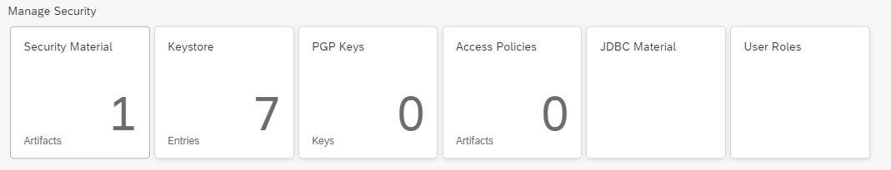
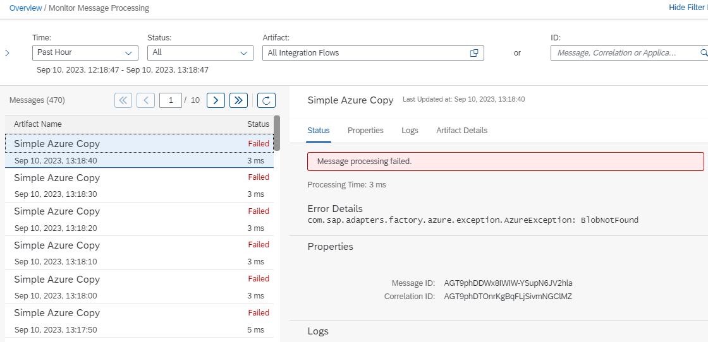

# SAP Integration Suite Sample Flow

## Sample Integration Flows

* Simple Azure Copy
* Simple JDBC Receiver

## Important tools

Configure JDBC driver and credentials under `Monitor/Integrations` in SAP Integration Suite:

Monitoring and logging:

## Ressources

* [Set Up Integration Suite Trial](https://developers.sap.com/tutorials/cp-starter-isuite-onboard-subscribe.html)
* [Design and Deploy Your First Integration Flow](https://developers.sap.com/tutorials/cp-starter-integration-cpi-design-iflow.html#6bcd4ecc-e312-4d8b-81e4-088c54beb216)
* [SAP Integration Suite- Deep dive into Content Modifier](https://blogs.sap.com/2021/12/03/sap-integration-suite-deep-dive-into-content-modifier/)
* [Using Camel Simple Expression Language](https://help.sap.com/docs/cloud-integration/sap-cloud-integration/using-camel-simple-expression-language?locale=en-US&q=Camel)
* [Document Format for the Receiver JDBC Adapter](https://help.sap.com/docs/SAP_NETWEAVER_702/ff4b17c66c55101488e1c652adb52951/4d8c103e05df2e4b95cbcc68fed61705.html?locale=en-US&version=7.02.22)